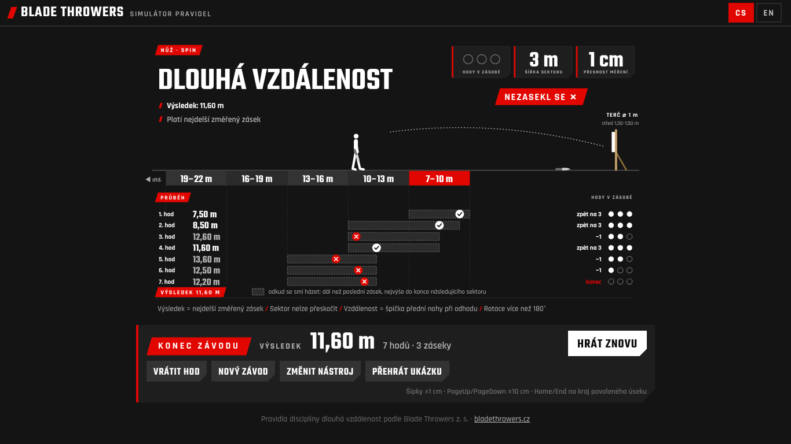

# Long Distance – knife & axe throwing rules simulator

A small browser game that lets anyone try out how the **Long Distance** discipline works at
[Blade Throwers z. s.](https://www.bladethrowers.cz/) competitions. You play one thrower: pick a tool,
choose the distance before every throw with a slider and decide whether the throw stuck. The game
enforces the rules, shows where you may throw from, animates the throw and calculates the result.

**Play:** https://drtileksoft.github.io/LongDistanceKnifeGame/ (after the first deployment, see below)



## Rules in a nutshell

| Variant | Sectors (3 m each) | Rotation |
| --- | --- | --- |
| Knife **no-spin** | from 4 m: 4–7, 7–10, 10–13 … | at most 170° |
| Knife **spin** | from 7 m: 7–10, 10–13, 13–16 … | more than 180° |
| **Axe** | from 7 m (same as spin) | not judged, only a blade stick counts |

1. You start with **3 throws in hand**, there are no practice throws.
2. Until your first stick you may throw from anywhere in the first sector (`start ≤ d ≤ start + 3 m`).
3. After a stick at distance *L* the next throw must be **farther than L** and **at most to the end of the
   next sector** (`L < d ≤ start + 3 m · (sector(L) + 2)`, `sector(d) = floor((d − start) / 3 m)`).
   A sector can never be skipped.
4. A stick is measured to 1 cm and the reserve goes **back to 3** throws.
5. A miss costs **one throw**. The allowed range does not change, so after a miss you may also move
   closer to the target, as long as you stay farther than your last stick.
6. At zero throws the event is over. **Result = the longest measured stick** (always the last one).
   No stick = no result.
7. Distance = toe of the front foot at release. Target ⌀ 1 m, centre 1.30–1.50 m above the ground.

## Run locally

It is a static site (HTML, CSS and ES modules, no build step, no runtime dependencies apart from
Google Fonts). Any static server works, e.g.

```sh
npx serve .            # or: python3 -m http.server
# or the bundled zero-dependency server, which also mimics the GitHub Pages sub-path:
npm start              # http://localhost:4173/LongDistanceKnifeGame/
```

URL parameters: `?lang=cs|en` forces the language (default: browser language, cs/sk → Czech,
otherwise English), `?tool=nospin|spin|axe` skips the tool selection.

Keyboard: Tab through the controls; on the slider the arrows move by 1 cm, PageUp/PageDown
by 10 cm, Home/End jump to the edges of the allowed range; Ctrl+Z undoes a throw.

## Test

```sh
npm install
npm test                 # rules engine unit tests (node:test), incl. all reference examples
npx playwright install chromium
npm run test:e2e         # Playwright smoke test: plays the SPIN example with the slider and buttons
```

## Project layout

| Path | What |
| --- | --- |
| `src/rules.js` | Pure rules engine (no DOM, immutable state, centimetres): `createGame`, `allowedRange`, `check`, `applyThrow`, `result`, `undo` |
| `src/examples.js` | Reference examples (used by the "Play example" button and the tests) |
| `src/i18n.js` | All texts in one dictionary – add a language by copying the `en` block |
| `src/scene.js`, `src/figure.js` | SVG scene 1920×1080, thrower pictogram and animations |
| `src/app.js` | Controller wiring rules, scene and controls |
| `tests/` | Unit tests, Playwright smoke test and a tiny static server |

## Deployment (GitHub Pages)

The workflow `.github/workflows/pages.yml` runs the tests on every push and pull request and deploys
`main` to GitHub Pages with `actions/deploy-pages`.
**In the repository go to Settings → Pages and set _Source_ to “GitHub Actions”**, otherwise the
deploy job fails. All paths are relative, so the site works under `/LongDistanceKnifeGame/`.

## Česky

Webová hra, na které si kdokoli vyzkouší pravidla disciplíny **dlouhá vzdálenost** na soutěžích
[Blade Throwers z. s.](https://www.bladethrowers.cz/). Hráč odehraje jednoho vrhače: vybere nástroj
(nůž no-spin, nůž spin nebo sekeru), před každým hodem nastaví posuvníkem vzdálenost a určí, jestli se
hod zasekl. Hra hlídá pravidla (dál než poslední zásek, sektor nelze přeskočit, zásoba 3 hodů),
ukazuje, odkud smí vrhač házet, a na konci spočítá výsledek – nejdelší změřený zásek. Hra je
v češtině a angličtině; spuštění a testy viz výše.
